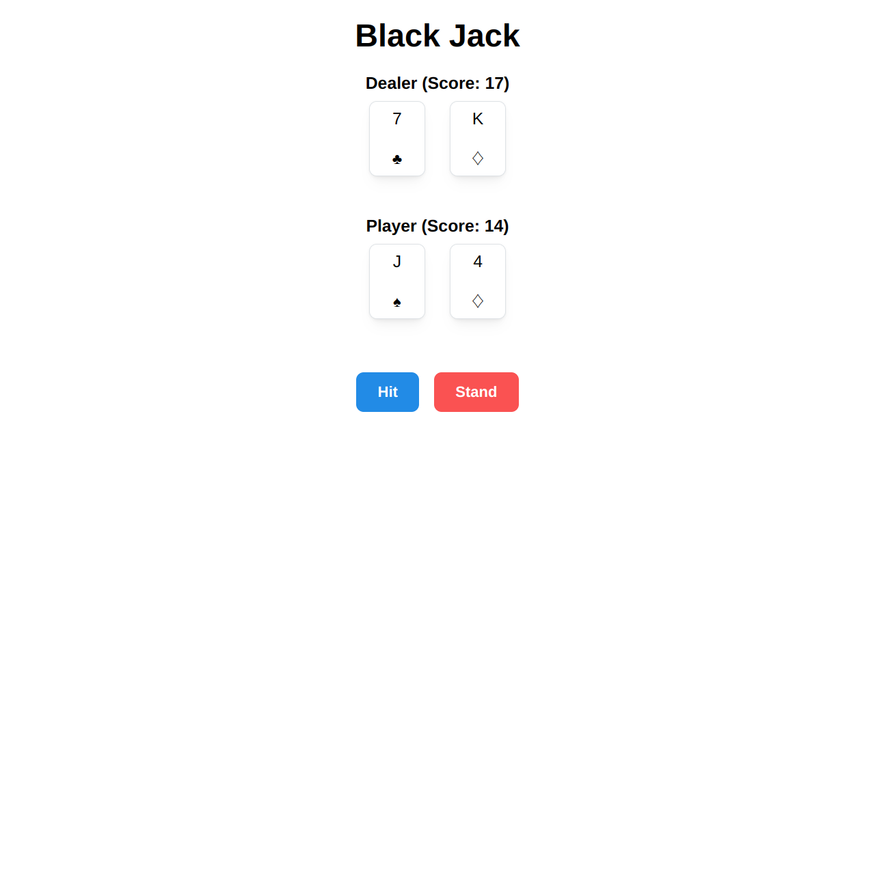

# React Blackjack

A simple implementation of Blackjack with React and Mantine.

[Play online](https://react-black-jack-git-main-hiromu-ushiharas-projects.vercel.app/)


<p align="center">
  
</p>

## Project Structure

```
ReactBlackJack/
├── public/
├── src/
│   ├── components/
│   │   ├── Card.js
│   │   ├── Hand.js
│   │   ├── Controls.js
│   │   └── ColorSchemeToggle.js
│   ├── utils/
│   │   ├── createDeck.js
│   │   └── calculateScore.js
│   ├── App.js
│   └── index.js
└── README.md
```

## How to Run Locally

```bash
git clone https://github.com/Hiromu-USHIHARA/ReactBlackJack.git
cd ReactBlackJack

npm install
npm start
```

Then open `http://localhost:3000` in your browser.

## Features

- Stylish UI using Mantine
- Dark mode toggle (top-right)

