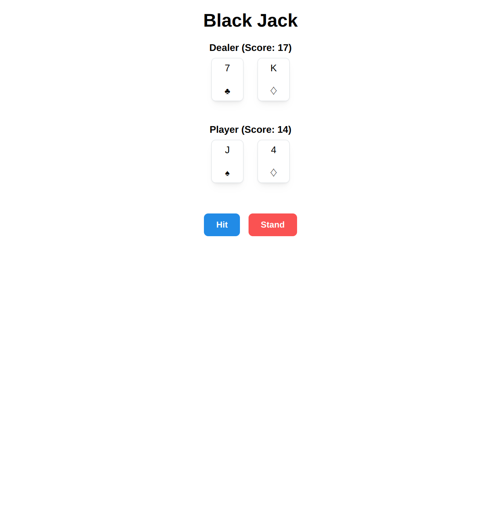

# React Blackjack

A simple implementation of Blackjack with React and Mantine.

[Play online](https://react-black-jack-git-main-hiromu-ushiharas-projects.vercel.app/)


<p align="center">
  
</p>

## Project Structure

```
ReactBlackJack/
├── public/
├── src/
│   ├── components/
│   │   ├── Card.jsx
│   │   ├── Hand.jsx
│   │   ├── Controls.jsx
│   │   └── ColorSchemeToggle.jsx
│   ├── utils/
│   │   ├── deck.js
│   │   └── calculateScore.js
│   ├── App.jsx
│   └── index.jsx
├── index.html
├── vite.config.js
└── README.md
```

## How to Run Locally

```bash
git clone https://github.com/Hiromu-USHIHARA/ReactBlackJack.git
cd ReactBlackJack

npm install
npm run dev
```

Then open `http://localhost:3000` in your browser. `npm start` also launches the Vite dev server.

## Features

- Stylish UI using Mantine
- Dark mode toggle (top-right)
- Added delay to dealer's card drawing for more realistic gameplay experience


